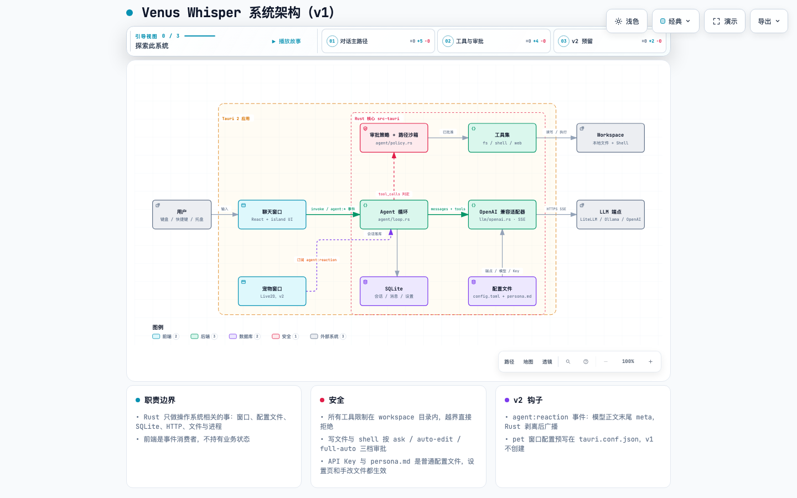

# Venus Whisper

跨平台的本地 LLM Agent 助手：能对话、能在指定目录内读写文件和执行命令，写操作按审批模式确认。Tauri 2 + Rust 内核 + React 前端，所有数据留在本机。

虚拟形象（Live2D）与情绪反应引擎是后续版本的能力，v1 只预留了接口，见 [docs/design/架构设计.md](docs/design/架构设计.md)。



## 功能

- 多会话聊天，流式输出，Markdown 渲染
- 七个内置工具：`read_file` `list_dir` `grep` `web_fetch` `write_file` `edit_file` `run_shell`
- 三档审批模式：`ask`（写文件和 shell 都问）/ `auto-edit`（写文件自动，shell 问）/ `full-auto`
- 所有工具限制在 workspace 目录内，路径越界直接拒绝
- 审批卡上的"总是允许"会把命令前缀持久化到配置，按 workspace 分组
- OpenAI 兼容接口，LiteLLM / Ollama / OpenAI 都能接
- 系统托盘 + 全局快捷键呼出（macOS `⌘⇧Space`，其他平台 `Ctrl+Shift+Space`）

## 快速开始

环境要求：Rust 1.80+、Node 20+、pnpm，以及 [Tauri 2 的系统依赖](https://tauri.app/start/prerequisites/)。

```bash
pnpm install
pnpm tauri dev
```

首次启动会在 `~/.venus-whisper/` 生成默认配置，填好端点和 Key 即可对话：

```toml
# ~/.venus-whisper/config.toml
[llm]
base_url = "http://localhost:4000/v1"   # OpenAI 兼容端点
model    = "gpt-4o"
api_key  = "sk-..."

[agent]
workspace     = "~/projects"            # 工具只能在这个目录内活动
approval_mode = "ask"                    # ask | auto-edit | full-auto
max_turns     = 30
```

同目录下的 `persona.md` 是 system prompt，可以直接改。设置页和手改文件都生效，下一条消息即读取。

`[ui] theme` 指向 `themes/` 目录下的文件名。主题文件长这样，键名对应界面里的 CSS 变量 `--vw-<key>` 和 `--code-<key>`，缺的键回落默认值：

```toml
# ~/.venus-whisper/themes/mine.toml
name = "我的紫罗兰"
description = "随便写"

[colors]
accent = "#8b5cf6"
accent-dark = "#6d3fd9"
side = "#f1ecff"
ink = "#3b2a6b"

[code]
keyword = "#8b5cf6"
```

## 项目结构

```
src/                 前端（React 18 + TypeScript + animal-island-ui），纯 UI，无业务逻辑
  api.ts             Rust 命令的类型化封装
  store.ts           zustand 状态 + agent:* 事件订阅
  events.ts          与 src-tauri/src/events.rs 手工对照的事件类型
  components/        Sidebar / ChatView / Blocks / SettingsView
src-tauri/           Rust 内核
  src/agent/         循环 runner.rs、审批 policy.rs、工具 tools/
  src/llm/           OpenAI 兼容流式客户端
  src/config.rs      ~/.venus-whisper 配置读写与监听
  src/store.rs       SQLite 会话与消息
  src/tray.rs        托盘与全局快捷键
docs/design/         架构设计、Rust 任务拆解、archify 图源
docs/prd/            产品需求（含 v2 虚拟形象反应系统）
demo/                聊天页的独立设计稿，不参与构建
```

前后端只通过 Tauri 命令和事件通信：前端 `invoke` 调 `src-tauri/src/commands.rs` 里的函数，Rust 用 `agent:delta` / `agent:tool_request` / `agent:tool_result` / `agent:done` / `agent:error` 等事件推回进展。

## 开发命令

```bash
pnpm tauri dev        # 开发运行
pnpm tauri build      # 打包
pnpm test:rust        # cargo test
pnpm lint:rust        # cargo clippy -D warnings
pnpm fmt              # cargo fmt
pnpm exec tsc --noEmit
```

Rust 侧有 25 个单测，其中一条契约测试会解析 `src/events.ts`，保证事件字段与 Rust 不漂移。

## 数据位置

| 路径 | 内容 |
|---|---|
| `~/.venus-whisper/config.toml` | 端点、模型、Key、workspace、审批模式、allowlist |
| `~/.venus-whisper/persona.md` | system prompt |
| `~/.venus-whisper/themes/*.toml` | 外观主题，内置 mint / peach / sky，复制一份改颜色即新主题，保存即生效 |
| `~/.venus-whisper/data.db` | SQLite：会话与消息，消息按 OpenAI 格式存 JSON |
| `~/.venus-whisper/window.json` | 主窗口位置、尺寸、最大化状态，退出时自动写入 |

API Key 以明文放在配置文件里，由用户自行管理。

## 许可证

代码为 [MIT](LICENSE)。UI 组件库 [animal-island-ui](https://github.com/guokaigdg/animal-island-ui) 为 CC BY-NC 4.0，仅限非商用；商用需替换组件层。
