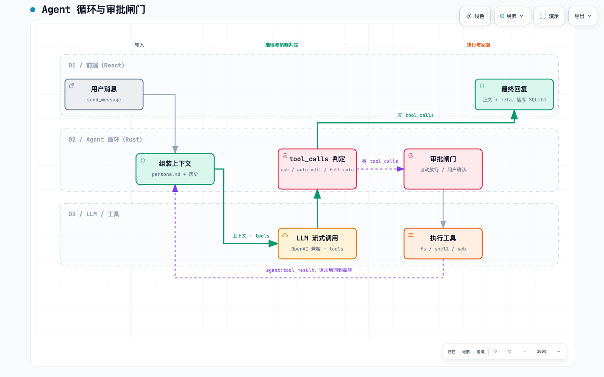

# Venus Whisper 架构设计（v1）

> 跨平台本地 Agent 助手。v1 聚焦 LLM 对话 + 工具调用 + 权限审批（对标 Codex / OpenClaw 的本地助手能力）；虚拟形象与反应引擎为 v2，v1 只预留接口。
> 产品背景见 [桌面互动应用 PRD](../prd/桌面互动应用.md)。

## 1. 目标与范围

**v1 交付**

1. Tauri 2 桌面壳：主聊天窗 + 系统托盘 + 全局快捷键呼出/隐藏
2. 聊天界面（animal-island 风格）：会话列表、流式 Markdown 渲染、工具调用卡、审批卡、workspace 选择
3. Rust Agent 循环：LLM 流式调用 → tool_calls 判定 → 策略审批 → 执行 → 结果回灌，直至无 tool_calls
4. 六个内置工具，全部限制在 workspace 目录内
5. OpenAI 兼容适配器（LiteLLM / Ollama / OpenAI 皆可）；API Key、端点、模型、persona 全部是用户可编辑的配置文件
6. SQLite 持久化会话与消息；`persona.md` 人格文件
7. 设置页：端点、模型、Key、workspace、审批模式

**v2（不在本期）**：宠物窗口 + Live2D、PRD 中的规则引擎/情绪状态机、MCP 客户端、长期记忆、语音输入/TTS。

**明确不做**：不把 Codex CLI / Claude Code 等本地 CLI 作为 sidecar，循环自己实现，不绑定任何外部 Agent 协议。

## 2. 技术选型

| 层 | 选择 | 理由 |
|---|---|---|
| 壳 | Tauri 2 | 体积小；原生窗口/托盘/快捷键；v2 需要的透明置顶窗口是核心能力 |
| 前端 | React 18 + TypeScript + Vite + animal-island-ui | 组件库本身是 React，且其打包产物绑定 React 18 的内部 API，不能用 React 19；主色 `#19c8b9`、大地棕文字、奶油底、胶囊按钮 |
| 前端状态 | zustand | 事件驱动的消息流用一个轻量 store 即可 |
| 后端 | Rust（tokio + reqwest + rusqlite） | 文件/进程/HTTP 都是 OS 能力，天然归 Rust |
| LLM 协议 | OpenAI Chat Completions（含 tools、SSE 流式） | LiteLLM 已把 Anthropic 等统一成该格式，Ollama 原生兼容，一个适配器覆盖云端与本地 |

**许可证提示**：animal-island-ui 为 CC-BY-NC-4.0（非商用）。若项目将来商用，改为只用其公开设计 token 自行实现按钮、输入框、卡片、气泡等少量组件。

## 3. 系统架构


可交互版本：[asset/architecture.html](asset/architecture.html)（源：`asset/architecture.json`）

**职责边界只有一条原则**：Rust 只做"操作系统的事"；前端是纯 UI，不持有业务状态。

- **Rust 核心（src-tauri）**：Agent 循环、审批策略与路径沙箱、工具集、OpenAI 兼容适配器、SQLite、配置文件读写、托盘/快捷键
- **前端（React）**：通过 `invoke` 发命令，订阅 `agent:*` 事件渲染消息流与审批卡
- **LLM 请求经 Rust 转发**而非前端直接 fetch：循环和工具都在 Rust，HTTP 客户端与 SSE 解析只保留一份

## 4. Agent 循环与审批



可交互版本：[asset/agent-loop.html](asset/agent-loop.html)（源：`asset/agent-loop.json`）

**循环规则**

```
loop (最多 MAX_TURNS 轮):
  messages = system(persona.md) + 历史 + 本轮
  stream = llm.chat(messages, tools)        # SSE，正文实时 emit agent:delta
  if no tool_calls: 剥离 <meta> → emit agent:done + agent:reaction → 落库 → break
  for call in tool_calls:
      verdict = policy.check(call, mode, workspace)
      if verdict == Ask: emit agent:tool_request → await 前端 approve/deny (oneshot channel)
      result = tools.run(call) if allowed else "denied by user"
      messages.push(tool_message(call.id, result)); emit agent:tool_result
```

- 拒绝不会中断循环，模型收到 `denied` 结果后自行调整
- 每轮工具输出截断（默认 16 KB），shell 默认超时 60 s，防止把上下文撑爆

**工具集（v1 六个）**

| 工具 | 行为 | 默认策略 |
|---|---|---|
| `read_file` / `list_dir` / `grep` | 只读 | 自动放行 |
| `write_file` / `edit_file`（精确字串替换） | 写 | 按模式 |
| `run_shell` | tokio 子进程，`cwd = workspace`，超时 + 截断 | 按模式 |
| `web_fetch` | 抓取网页转纯文本 | 自动放行 |

**审批模式**（沿用 Codex 三档，默认 `ask`）

| 模式 | 文件写入（workspace 内） | shell |
|---|---|---|
| `ask` | 询问 | 询问 |
| `auto-edit` | 自动 | 询问 |
| `full-auto` | 自动 | 自动 |

不论哪档，路径越出 workspace 一律拒绝且不询问。审批卡三个按钮：允许 / 拒绝 / 本会话总是允许该命令前缀。

## 5. 前后端契约

**命令（前端 → Rust）**

| 命令 | 参数 | 说明 |
|---|---|---|
| `send_message` | `session_id, text` | 启动一轮循环，立即返回，结果走事件 |
| `approve_tool` | `session_id, call_id, decision: allow \| deny \| always` | 回应审批请求；`call_id` 即事件里的原始 id |
| `cancel_run` | `session_id` | 中断当前循环 |
| `list_sessions` / `create_session` / `rename_session` / `get_messages` / `delete_session` | — | 会话 CRUD |
| `get_settings` / `set_settings` | — | 读写 `config.toml`：端点、模型、API Key、workspace、审批模式 |
| `get_persona` / `set_persona` | — | 读写 `persona.md` |
| `open_config_dir` | — | 在文件管理器打开 `~/.venus-whisper/`，方便手改 |
| `list_themes` | — | 读取 `themes/*.toml`，解析失败的文件跳过 |

**事件（Rust → 前端）**，payload 均带 `session_id`

| 事件 | payload |
|---|---|
| `agent:delta` | `{ text }` 正文增量 |
| `agent:tool_request` | `{ call_id, name, args, reason }` 等待审批 |
| `agent:tool_result` | `{ call_id, name, args, output, ok, duration_ms }` |
| `agent:done` | `{ message_id }` |
| `agent:error` | `{ message }` |
| `agent:reaction` | `{ emotion, intent, suggested_reaction, confidence }` v2 钩子 |

TS 类型手写在 `src/events.ts`，与 Rust `serde` 结构一一对应；不引入代码生成。

## 6. 数据与配置

**SQLite**（`~/.venus-whisper/data.db`，rusqlite，Rust 侧直接访问）

```sql
sessions (id TEXT PK, title TEXT, workspace TEXT, created_at INTEGER)
messages (id TEXT PK, session_id TEXT, role TEXT, content_json TEXT, created_at INTEGER)
settings (key TEXT PK, value TEXT)
```

`messages.content_json` 直接存 OpenAI 消息格式（含 `tool_calls` 与 `tool` 结果），重放对话零转换。

**配置文件**（`~/.venus-whisper/`，用户可在设置页改，也可直接手改文件）

```toml
# config.toml
[llm]
base_url = "http://localhost:4000/v1"   # OpenAI 兼容端点：LiteLLM / Ollama / OpenAI
model    = "gpt-4o"
api_key  = "sk-..."

[agent]
workspace     = "/Users/me/projects"
approval_mode = "ask"                    # ask | auto-edit | full-auto
max_turns     = 30
```

- `persona.md`：system prompt，用户可改人格不改代码
- `window.json`：主窗口位置/尺寸/最大化，移动或缩放后 500ms 落盘，关闭与托盘退出时立即落盘；恢复时若位置不在任何显示器上则居中
- `themes/<id>.toml`：外观主题（`name`、`description`、`[colors]`、`[code]`），内置三套首次启动写入且不覆盖用户改动；前端把键值写成 `--vw-*` / `--code-*` CSS 变量，`[ui] theme` 选中其一
- 首次启动若文件不存在，Rust 写入带注释的默认模板
- 每次 `send_message` 启动循环时重新读取，手改文件无需重启；目录递归监听（含 `themes/`），变化后 300ms 发 `config:changed` 让设置页与主题即时刷新
- SQLite 的 `settings` 表只存 UI 状态（窗口位置、上次会话等），不存业务配置

## 7. 目录结构

```
venus-whisper/
├─ src-tauri/
│  ├─ src/
│  │  ├─ agent/   loop.rs  policy.rs  tools/{fs.rs, shell.rs, web.rs}
│  │  ├─ llm/     openai.rs        SSE 解析、tool_calls 分片拼装
│  │  ├─ store.rs  config.rs  tray.rs  commands.rs
│  │  └─ lib.rs
│  ├─ migrations/
│  └─ tauri.conf.json              含预写的 pet 窗口配置（v1 不创建）
├─ src/
│  ├─ features/chat/      会话列表、消息流、工具调用卡、审批卡、输入框
│  ├─ features/settings/
│  ├─ events.ts           事件与命令的 TS 类型
│  ├─ store.ts            zustand
│  └─ ui/                 animal-island-ui 主题封装
└─ docs/
```

## 8. v2 预留（只留三样）

1. **`agent:reaction` 事件**：system prompt 要求模型正文末尾附 `<meta>{"emotion","intent","suggested_reaction","confidence"}</meta>`；Rust 剥离后广播。`suggested_reaction` 必须属于 PRD 定义的动作闭集（`ACTIONS`，Rust/TS 共用常量），否则回落 `idle_breath`。v1 前端仅用它显示状态胶囊（思考中 / 执行工具 / 完成）。
2. **前端与核心只通过命令和事件通信**，不共享状态。宠物窗口就是第二个事件订阅者。
3. **`tauri.conf.json` 预写 `pet` 窗口**：`transparent`、`decorations: false`、`alwaysOnTop`、`skipTaskbar`，macOS 需 `macOSPrivateApi: true`。

PRD 中的规则引擎、情绪状态机、Live2D 渲染器（pixi-live2d-display + Cubism Core）全部推到 v2。

## 9. 已决策项与风险

| 项 | 决策 |
|---|---|
| 循环实现 | 自己写，不用 sidecar CLI，不引 Agent 框架 |
| LLM 协议 | 仅 OpenAI 兼容；Anthropic 等经 LiteLLM |
| API Key 存储 | 明文放 `config.toml`，与 persona.md 同目录，用户自行管理；不用系统钥匙串 |
| 默认审批模式 | `ask` |
| UI 库许可证 | 个人项目直接用 animal-island-ui；商用需改为自实现 |
| pixi-live2d-display 锁 PixiJS 6 | v2 再决定用原库还是维护中的 fork |

## 10. 里程碑

1. **M1 骨架**：Tauri 2 + React 工程；`send_message` 到 `agent:delta` 打通纯对话流；SQLite 落库
2. **M2 工具**：六个工具 + 路径沙箱 + 三档策略 + 审批卡；`config.toml` / `persona.md` 默认模板与设置页读写
3. **M3 打磨**：托盘、快捷键、设置页、错误处理、`agent:reaction` 透传
